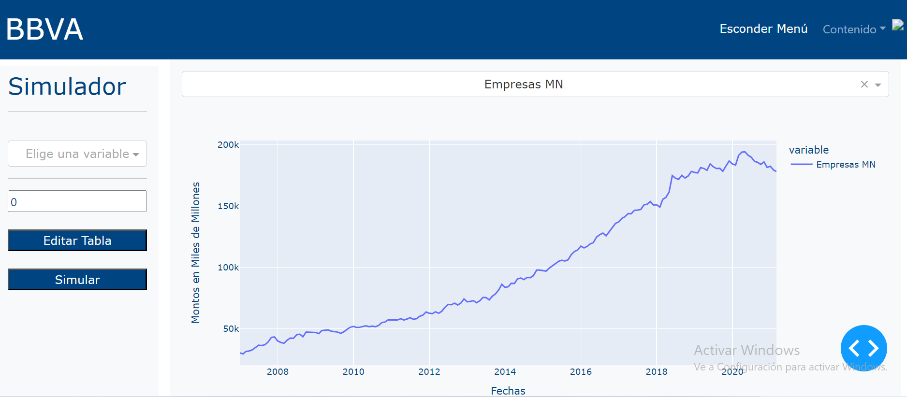

# Simulador de Escenarios de Suficiencia de Capital

¡Bienvenido al Simulador de Escenarios de Suficiencia de Capital!

## 1. Introducción

De acuerdo a las normas de análisis de suficiencia de capital regidos por la CNBV (Comisión Nacional Bancaria y de Valores), las instituciones financieras están obligadas a mantener ciertos niveles de capital que permitan hacer frente a crisis económicas. El ICAP es la métrica que refleja la fortaleza financiera de una institución para soportar pérdidas no esperadas por los riesgos en los que incurre, lo que le permite establecer de manera oportuna medidas preventivas y correctivas con relación a potenciales problemas de solvencia.

Por ello, es vital que cada institución cuente con herramientas que permitan generar de manera eficiente escenarios económicos que ayuden a anticipar acciones preventivas, como lo es analizar el comportamiento de su balance general.

## 2. Descripción

Este simulador es una herramienta esencial para instituciones financieras, como BBVA, que buscan anticipar y gestionar su suficiencia de capital en escenarios macroeconómicos diversos. Desarrollado en cumplimiento con las normativas de la CNBV, el simulador proporciona proyecciones a dos años, analizando productos bancarios clave en respuesta a factores macroeconómicos y financieros.

### Principales Características:

- **Proyecciones Eficientes:** Genere proyecciones de comportamiento para productos bancarios en diferentes escenarios macroeconómicos.
  
- **Análisis en Profundidad:** Explore el impacto de factores como el Índice Nacional de Precios al Consumidor, Tasa de Desempleo, PIB, Tipo de Cambio y más.

- **Metodología Robusta:** Basado en modelos de machine learning, nuestro enfoque analítico garantiza proyecciones respaldadas por análisis detallados.

El simulador mostrado en este espacio es una prueba piloto que integra un conjunto acotado de productos y variables para la demostración de sus funcionalidades.

### Productos y Variables Analizadas

**Productos:**

| Nº | Producto                               |
|---|----------------------------------------|
| 01 | **Cartera de Empresas Moneda Nacional**   |
| 02 | **Cartera Hipotecaria**                   |
| 03 | **Ahorro Moneda Nacional**                 |
| 04 | **Vista Moneda Nacional**                  |

**Variables Macroeconómicas:**

| Nº | Variable                 |
|---|--------------------------|
| 01 | **INPC - Índice Nacional de Precios al Consumidor** |
| 02 | **Tasa de Desempleo**        |
| 03 | **PIB - Producto Interno Bruto** |
| 04 | **Tipo de Cambio USD**      |
| 05 | **Cetes a 6 meses**         |
| 06 | **Cetes a 12 meses**        |
| 07 | **Bonos a 10 años**          |
| 08 | **Empleo IMSS**             |
| 09 | **Salario**                 |

### Capturas de Pantalla

Inserta imágenes que muestren la interfaz del simulador y su fácil navegación.



## 3. Inicio Rápido

Sigue estos pasos para comenzar a utilizar el simulador:

1. Clone este repositorio: `git clone https://github.com/edadlopezgon/simulador-ecm23.git`
2. Ubicado en la carpeta principal del proyecto, ejecuta en terminal `docker-compose up --build` para iniciar la aplicación.

¡Comienza a explorar y analizar tus escenarios de suficiencia de capital ahora mismo!

## 4. Detalles de Almacenamiento

Este simulador utiliza un entorno de Docker para manejar el almacenamiento de datos. Aquí se describen los detalles de la estructura de archivos:

### Estructura de Archivos

El proyecto tiene la siguiente estructura de archivos:

```plaintext
.
├── api
│   ├── app.py           # Aplicación Flask que facilita la transmisión de bases de datos y modelos en Dash
│   ├── Dockerfile       # Archivo Docker para crear un entorno Docker para la aplicación Flask
│   ├── requirements.txt  # Lista de requisitos de librerías necesarios para generar el entorno
├── dash
│   ├── appDash.py       # Frontend en Dash donde los usuarios interactúan para generar simulaciones
│   ├── Dockerfile       # Archivo Docker para crear un entorno Docker para el frontend de Dash
│   ├── requirements.txt  # Lista de requisitos de librerías necesarios para generar el entorno
├── database_postgresql
│   ├── database.env           # Configuración de variables de entorno para la base de datos PostgreSQL
│   ├── init.sql               # Archivo SQL de inicialización para crear tablas y datos iniciales
│   ├── historical_data.csv    # Archivo CSV con datos históricos de cartera y captación
│   ├── exog_forecast_data.csv # Archivo CSV con datos exógenos para pronósticos
│   ├── exog_historical_data.csv  # Archivo CSV con datos exógenos históricos
├── docker-compose.yml         # Orquestador para inicializar los entornos y visualizar el simulador


